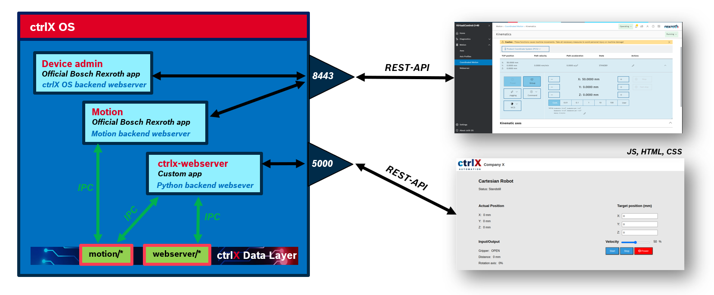

# ctrlx-webserver

May 2024, DCEM Bosch Rexroth

Contact: Aria Malik Havidiansyah (ariamalik.havidiansyah@boschrexroth.de) and Raul Cruz Oliver (raul.cruz-oliver@boschrexroth.ch)

## Introduction

This repository contains the source code to build your own custom user interface based on a Python Flask webserver. The webserver communicates with the official ctrlX Motion app though the datalayer.

In the following image one can see an overview of the system topology. 

As presented in the image, the custom webserver is available through the port 5000. 

For complementary, we are showing that the basic web interface provided by ctrlX OS is available in the port 8443.

### Platform notes
This example has been developped for ctrlX OS 2.4, in which the official 2.4 version of the Motion App has been installed.

**NOTE:** In version 2.6 there would be substancial changes in the way metadata is managed, we will provide an example for this new ctrlX OS as soon at is available in a different branch in this repository. Stay tuned!

We assume the reader has access to the 2.4 ctrlX SDK and all the dependencies to build the python examples from such SDK are installed in the system in which this project is going to be compiled, if you are working in an the App-Build enviroment, the dependencies will be most likely installed in the system already. 

Apart from having such dependencies installed in the system (basically the datalayer and zmq packages, and of course snapcraft), this project is self contained and this repository can be cloned in any directory in your system and the automatic build scripts must run without errors.

## Files description

### Project README and LICENSE
- **README.md**
- **LICENSE**

### Snap build files
- **snap/snapcraft.yalm** : it contains the instructions to build the snap package
- **build-snap-amd64.sh** : it builds automatically the snap for amd64 platforms using snapcraft.
- **build-snap-arm64.sh** : it builds automatically the snap for arm64 platforms using snapcraft.

### Automatic flatbuffers compiler
- **make-bfbs-pyfbs.sh** : it generates automatically binary files and python libraries from flatbuffers files (.fbs)
- **make-mddb.sh** : it generates automatically binary files 

### Flatbuffers related files
- **flatbuffers\*** : it contains flatbuffer files (.fbs)
- **bfbs/\*** : it contains the binary files generated from flatbuffers files (.fbs)
- **motion/core/fbtypes\*** : it contains python libraries generated from flatbuffers files (.fbs) 
- **robot/core/fbtypes\*** : it contains python libraries generated from flatbuffers files (.fbs) 

### Compilation tools
- **bin/comm.datalayer/ubuntu22-gcc-x64/release/mddb_compiler** : tool to compile metadata files (.csv) into binary (.mddb)
- **bin/oss.flatbuffers/ubuntu22-gcc-x64/release/flatc** : tool to compile flatbuffer files (.fbs) into binary (.bfbs) and into pyhon libraries

### App manager and configuration
- **appdata/appdatacontrol.py** : functionalies to manage snap inside ctrlX OS
- **config/package-assets/ctrlx-webserver.package-manifest.json** : definitions to manage the snap inside ctrlX OS

### Documentation
- **docs/images\*** : images used in the README.md

### Datalayer provider functionalities
- **datalayerProvider.py** : functionalities to create a datalayer node
- **app/my_provider_node.py\*** : implementation to create a datalayer node
- **metadata.cvs** : it contains the datalayer node metadata definition
- **mddb/\*** : it contains compiled datalayer node metadata

## Webserver backend
- **main.py** : it constaint the backend implementation

##  Webserver frontend
- **static/\*** : it contains javascript and css files
- **templates/index.html** : it constains the frontend implementation, with embedded javascript code

### Python package setup files
- **setup.py**
- **setup.cfg**

### Other files
- **install-venv.sh** : automatically install the required packaged in virtual environment
- **requirements.txt** : dependenciies list that will be installed 
- **venv/\*** : it contains dependencies needed when working in a virtual environement
- **settings.py**

## Implementation information

### Flatbuffers

### Metadata

## Function Description

### ctrlX OS setup

### Webserver functionalities

The app connects to the ctrlX Data Layer and provides a string and flatbuffers node .

If the Data Layer connection breaks the app will exit. After 10s it will be automatically restarted by snapd.

## Implementation Description

### Compile Flatbuffers Schema

This app uses a flatbuffer defined in the schema file sampleSchema.fbs. From this schema file we have to create a binary file which is registered on the ctrlX and a Python class to create and access the defined flatbuffer data. These tasks can be done with the command line tool flatc.

This tool is provided by this SDK under /bin/oss.flatbuffers/..insert OS version here../release/

Do following steps - OS version here is 'linux-gcc-x64':

* Create a binary flatbuffers file:

    ../../bin/oss.flatbuffers/linux-gcc-x64/release/flatc -o bfbs/ -b --schema sampleSchema.fbs

* Generate the Python code:

    ../../bin/oss.flatbuffers/linux-gcc-x64/release/flatc --python sampleSchema.fbs

The generated code is stored in sample/schema/InertialValue.py

### Modules

* The module __main.py__ manages the Data Layer connection and the creation of the Data Layer nodes.
* The module __app/my_provider_node.py__ contains the class MyProviderNode with the callback function needed by the Data Layer.
* The file __sampleSchema.fbs__ contains the schema for the flatbuffers data struct used by this app.
* The module __sample/schema/InertialValue.py__ is generated by flatc from sampleSchema.fbs. It is used to manage the flatbuffers data struct.

___

